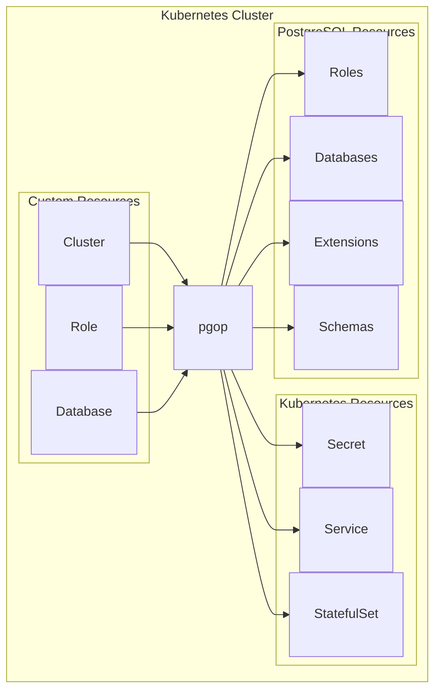

# pgop - PostgreSQL Operator

A simple Kubernetes operator for managing PostgreSQL databases.

## Features

- **Cluster Management** - Deploy PostgreSQL instances with automatic credential generation
- **Role Management** - Provision database roles with configurable permissions (LOGIN, SUPERUSER, etc.)
- **Database Management** - Create databases with extensions, schemas, and grants

## Quick Start

```bash
# Install the operator
helm upgrade -i pgop oci://ghcr.io/ruckc/charts/pgop \
  --namespace pgop-system \
  --create-namespace

# Create a PostgreSQL cluster
kubectl apply -f - <<EOF
apiVersion: pgop.ruck.io/v1alpha1
kind: Cluster
metadata:
  name: my-cluster
spec:
  image: postgres:18
  storage:
    size: 5Gi
EOF
```

## Architecture




## Documentation

- [Installation](getting-started/installation.md) - How to install the operator
- [Quick Start](getting-started/quickstart.md) - Create your first cluster
- [User Guide](user-guide/clusters.md) - Detailed usage instructions
- [API Reference](reference/api.md) - CRD specifications

## License

Apache License 2.0
