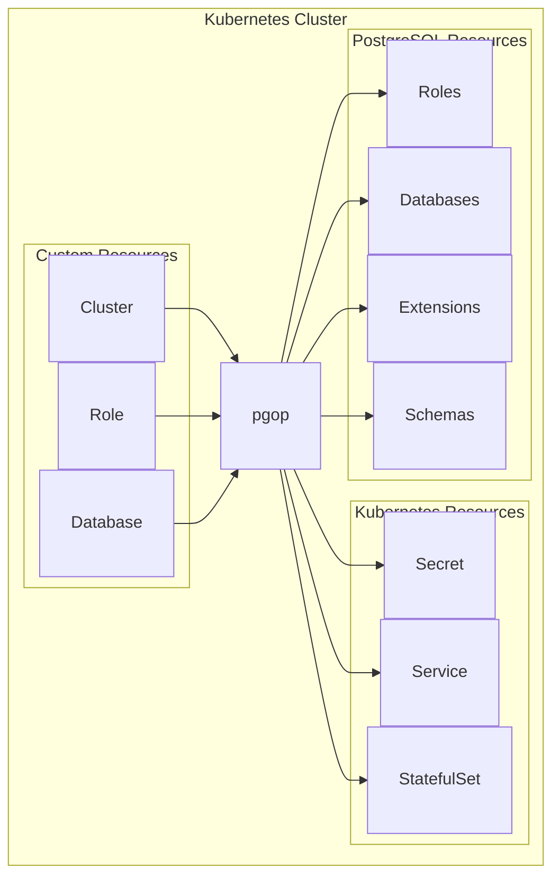

# pgop - PostgreSQL Operator

A simple Kubernetes operator for managing PostgreSQL databases.

## Features

- **Cluster Management** - PostgreSQL 16-18 with generated credentials, read replicas, TLS and server parameters
- **Role Management** - Login and group roles, memberships, passwords from your Secrets or rotated, per-role settings; privileged attributes only through the Cluster's role policy (no superusers)
- **Database Management** - Databases with extensions, schemas, database/schema/object grants, default privileges and settings, tracked and revoked when removed
- **Backups and Restores** - Logical (pg_dump) and physical (pgBackRest, point-in-time) backups to S3

## Quick Start

```bash
# Install the operator
helm upgrade -i pgop oci://ghcr.io/ruckc/charts/pgop \
  --namespace pgop-system \
  --create-namespace

# Create a PostgreSQL cluster
kubectl apply -f - <<EOF
apiVersion: pgop.ruck.io/v1alpha1
kind: Cluster
metadata:
  name: my-cluster
spec:
  image: postgres:18
  storage:
    size: 5Gi
EOF
```

## Architecture


```mermaid
%%{init: {'flowchart': {'nodeSpacing': 1, 'rankSpacing': 5}}}%%
flowchart TB
    subgraph k8s["Kubernetes Cluster"]
        subgraph crds["Custom Resources"]
            cluster["Cluster"]
            role["Role"]
            database["Database"]
        end
        
        operator["pgop"]
        
        subgraph k8sres["Kubernetes Resources"]
            secret["Secret"]
            service["Service"]
            sts["StatefulSet"]
        end
        
        subgraph pgres["PostgreSQL Resources"]
            pgrole["Roles"]
            pgdb["Databases"]
            pgext["Extensions"]
            pgschema["Schemas"]
        end
        
        cluster --> operator
        role --> operator
        database --> operator
        
        operator --> secret
        operator --> service
        operator --> sts
        
        operator --> pgrole
        operator --> pgdb
        operator --> pgext
        operator --> pgschema
    end

    classDef default padding:5px 5px
```


## Documentation

- [Installation](getting-started/installation.md) - How to install the operator
- [Quick Start](getting-started/quickstart.md) - Create your first cluster
- [User Guide](user-guide/clusters.md) - Detailed usage instructions
- [Users and Access Patterns](user-guide/access-patterns.md) - Complete role and grant setups
- [API Reference](reference/api.md) - CRD specifications
- [Upgrade Notes](upgrading.md) - Breaking changes by release

## License

Apache License 2.0
